# Architecture Diagrams - Shop-Floor Resource Allocation System

## System Architecture Overview


## Component Hierarchy


## Data Flow Architecture


## State Management Flow


## Resource Allocation Process


## Type System Relationships


## Validation Logic Flow


## Deployment Architecture


## Technology Stack


---

## Testing Strategy


**Testing Tools:**
- **Vitest** - Fast unit testing framework
- **React Testing Library** - Component testing
- **Playwright/Cypress** - E2E testing
- **MSW (Mock Service Worker)** - API mocking
- **@testing-library/user-event** - User interaction simulation

**Test Commands:**
```bash
npm run test              # Run unit tests
npm run test:coverage     # Generate coverage report
npm run test:e2e          # Run end-to-end tests
npm run test:watch        # Watch mode for development
```

---

## Performance Optimization


**Performance Targets:**
- First Contentful Paint (FCP): < 1.5s
- Largest Contentful Paint (LCP): < 2.5s
- Time to Interactive (TTI): < 3.5s
- Total Bundle Size: < 300KB (gzipped)
- Resource Utilization Update: < 100ms

---

## Security Best Practices


**Security Checklist:**
- ✅ Validate all user inputs
- ✅ Sanitize data before rendering
- ✅ Use HTTPS in production
- ✅ Implement CSP headers
- ✅ Regular dependency updates
- ✅ Secure credential storage
- ✅ Rate limiting on API calls
- ✅ Audit logging for critical actions

**Security Commands:**
```bash
npm audit                 # Check for vulnerabilities
npm audit fix             # Auto-fix security issues
npm audit fix --force     # Force fix breaking changes
```

---

## Accessibility Standards (WCAG 2.1 AA)


**Accessibility Features:**
- Semantic HTML elements
- ARIA labels for screen readers
- Keyboard navigation support
- Focus trap in modals
- Color contrast compliance
- Text alternatives for visual content
- Skip navigation links

---

## Required Skills & Tools

### Developer Skills

**Frontend Development:**
- ✅ React 18 (Hooks, Context, Performance)
- ✅ TypeScript (Advanced types, Generics, Interfaces)
- ✅ Modern CSS (Flexbox, Grid, Variables, Animations)
- ✅ Responsive Design (Mobile-first, Media queries)
- ✅ HTML5 (Semantic markup, Accessibility)

**State Management:**
- ✅ Zustand (Store creation, Actions, Selectors)
- ✅ React Hooks (useState, useEffect, useMemo, useCallback)
- ✅ State patterns (Global vs Local state)

**Development Tools:**
- ✅ Git (Version control, Branching, Pull requests)
- ✅ VS Code (Extensions, Debugging, IntelliSense)
- ✅ npm/yarn (Package management, Scripts)
- ✅ Chrome DevTools (Debugging, Performance profiling)

**Testing:**
- ✅ Unit testing (Jest/Vitest)
- ✅ Component testing (React Testing Library)
- ✅ E2E testing (Playwright/Cypress)

**Design Patterns:**
- ✅ Component composition
- ✅ Custom hooks
- ✅ HOC (Higher-Order Components)
- ✅ Render props
- ✅ Container/Presentational pattern

### Recommended VS Code Extensions

```json
{
  "recommendations": [
    "dbaeumer.vscode-eslint",
    "esbenp.prettier-vscode",
    "bradlc.vscode-tailwindcss",
    "ms-vscode.vscode-typescript-next",
    "streetsidesoftware.code-spell-checker",
    "eamodio.gitlens",
    "formulahendry.auto-rename-tag",
    "dsznajder.es7-react-js-snippets",
    "bierner.markdown-mermaid",
    "yzhang.markdown-all-in-one",
    "christian-kohler.path-intellisense",
    "wix.vscode-import-cost",
    "pflannery.vscode-versionlens",
    "usernamehw.errorlens"
  ]
}
```

---

## CI/CD Pipeline


**GitHub Actions Workflow:**
```yaml
name: CI/CD Pipeline

on:
  push:
    branches: [main, develop]
  pull_request:
    branches: [main]

jobs:
  test:
    runs-on: ubuntu-latest
    steps:
      - uses: actions/checkout@v3
      - uses: actions/setup-node@v3
        with:
          node-version: '18'
      - run: npm ci
      - run: npm run lint
      - run: npm run type-check
      - run: npm run test:coverage
      - run: npm run build

  deploy:
    needs: test
    if: github.ref == 'refs/heads/main'
    runs-on: ubuntu-latest
    steps:
      - run: npm run build
      - uses: actions/deploy-pages@v2
```

---

## Error Handling Strategy


**Error Handling Patterns:**

1. **User Input Errors** - Inline validation with helpful messages
2. **Network Errors** - Retry with exponential backoff
3. **System Errors** - Error boundaries with fallback UI
4. **Async Errors** - Try-catch with user notifications
5. **State Errors** - State validation and recovery

Example Error Boundary:
```typescript
class ErrorBoundary extends React.Component {
  state = { hasError: false };
  
  static getDerivedStateFromError(error) {
    return { hasError: true };
  }
  
  componentDidCatch(error, errorInfo) {
    // Log to monitoring service
    console.error('Error:', error, errorInfo);
  }
  
  render() {
    if (this.state.hasError) {
      return <ErrorFallback />;
    }
    return this.props.children;
  }
}
```

---

## Browser & Device Support

```mermaid
graph TB
    subgraph "Desktop Browsers"
        Chrome[Chrome 90+<br/>✅ Full Support]
        Firefox[Firefox 88+<br/>✅ Full Support]
        Safari[Safari 14+<br/>✅ Full Support]
        Edge[Edge 90+<br/>✅ Full Support]
    end
    
    subgraph "Mobile/Tablet"
        iOS[iOS Safari 14+<br/>✅ Optimized]
        Android[Android Chrome 90+<br/>✅ Optimized]
        iPad[iPad Safari<br/>✅ Touch Optimized]
    end
    
    subgraph "Features"
        Touch[Touch Events<br/>Drag & Drop]
        Responsive[Responsive Design<br/>Breakpoints]
        PWA[PWA Ready<br/>Offline Capable]
    end
    
    Chrome --> Touch
    iOS --> Touch
    Android --> Touch
    
    Safari --> Responsive
    iPad --> Responsive
    
    Edge --> PWA
    Firefox --> PWA
    
    style Chrome fill:#10b981,color:#fff
    style iOS fill:#667eea,color:#fff
```



**Supported Resolutions:**
- Desktop: 1920x1080, 1366x768, 1440x900
- Tablet: 1024x768 (iPad), 800x600
- Mobile: 375x667 (iPhone), 360x640 (Android)

**Touch Optimization:**
- Minimum touch target: 44x44px
- Swipe gestures supported
- Touch-friendly drag and drop
- Optimized tap delays

---

## API Integration Patterns


**API Client Template:**
```typescript
// src/api/client.ts
import axios from 'axios';

const apiClient = axios.create({
  baseURL: import.meta.env.VITE_API_URL,
  timeout: 10000,
  headers: {
    'Content-Type': 'application/json',
  },
});

// Request interceptor
apiClient.interceptors.request.use(
  (config) => {
    const token = localStorage.getItem('token');
    if (token) {
      config.headers.Authorization = `Bearer ${token}`;
    }
    return config;
  },
  (error) => Promise.reject(error)
);

// Response interceptor
apiClient.interceptors.response.use(
  (response) => response.data,
  (error) => {
    if (error.response?.status === 401) {
      // Handle unauthorized
    }
    return Promise.reject(error);
  }
);

export default apiClient;
```

---

## Monitoring & Observability


**Monitoring Tools:**
- **Sentry** - Error tracking and reporting
- **Google Analytics** - User behavior analytics
- **Lighthouse** - Performance auditing
- **Web Vitals** - Core performance metrics
- **Custom Metrics** - Business-specific tracking

**Key Metrics to Track:**
- User session duration
- Allocation success rate
- Resource utilization trends
- Error frequency and types
- Page load times
- API response times

---

## Setup & Prerequisites

### System Requirements

**Required:**
- Node.js 18.x or higher
- npm 9.x or higher
- Git 2.x or higher
- 4GB RAM minimum
- Modern web browser (Chrome 90+, Firefox 88+, Safari 14+)

**Optional:**
- VS Code with recommended extensions
- Docker for containerization
- Postman for API testing

### Environment Setup

1. **Install Node.js:**
```bash
# Windows (using Chocolatey)
choco install nodejs

# macOS (using Homebrew)
brew install node

# Linux (Ubuntu/Debian)
curl -fsSL https://deb.nodesource.com/setup_18.x | sudo -E bash -
sudo apt-get install -y nodejs
```

2. **Clone Repository:**
```bash
git clone <repository-url>
cd Shop-Floor-Resource-Allocation
```

3. **Install Dependencies:**
```bash
npm install
```

4. **Configure Environment:**
```bash
# Create .env file
cp .env.example .env

# Edit .env with your configuration
VITE_API_URL=https://api.example.com
VITE_WS_URL=wss://api.example.com
VITE_REFRESH_INTERVAL=5000
```

5. **Start Development:**
```bash
npm run dev
```

### Development Workflow

```bash
# Create feature branch
git checkout -b feature/your-feature

# Make changes and test
npm run dev
npm run test
npm run lint

# Commit changes
git add .
git commit -m "feat: add your feature"

# Push and create PR
git push origin feature/your-feature
```

---

## Code Quality Tools


**Pre-commit Hook Configuration:**
```json
{
  "husky": {
    "hooks": {
      "pre-commit": "lint-staged",
      "pre-push": "npm run test"
    }
  },
  "lint-staged": {
    "*.{ts,tsx}": [
      "eslint --fix",
      "prettier --write"
    ],
    "*.{css,scss}": [
      "stylelint --fix",
      "prettier --write"
    ]
  }
}
```

---

## Legend

- **Purple** - Main application components
- **Green** - State management and validation
- **Orange** - User interaction points
- **Blue** - Data flow and processes
- **Red** - Error states and critical paths

## Quick Reference

### Essential Commands
```bash
npm install              # Install dependencies
npm run dev              # Start dev server
npm run build            # Production build
npm run preview          # Preview production build
npm run lint             # Run ESLint
npm run type-check       # Run TypeScript check
npm test                 # Run tests
npm run test:coverage    # Test with coverage
npm audit                # Check security
```

### Useful Links
- 📚 [React Documentation](https://react.dev/)
- 📘 [TypeScript Handbook](https://www.typescriptlang.org/docs/)
- 🐻 [Zustand Docs](https://github.com/pmndrs/zustand)
- 🎯 [React DnD](https://react-dnd.github.io/react-dnd/)
- ⚡ [Vite Guide](https://vitejs.dev/guide/)

## Rendering Diagrams

These diagrams can be rendered in:
- **GitHub** - Native mermaid support
- **VS Code** - With Mermaid extension
- **Documentation sites** - GitBook, Docusaurus
- **Online tools** - [mermaid.live](https://mermaid.live)

### To render in VS Code:
1. Install "Markdown Preview Mermaid Support" extension
2. Open this file
3. Press `Ctrl+Shift+V` (Windows/Linux) or `Cmd+Shift+V` (macOS)
