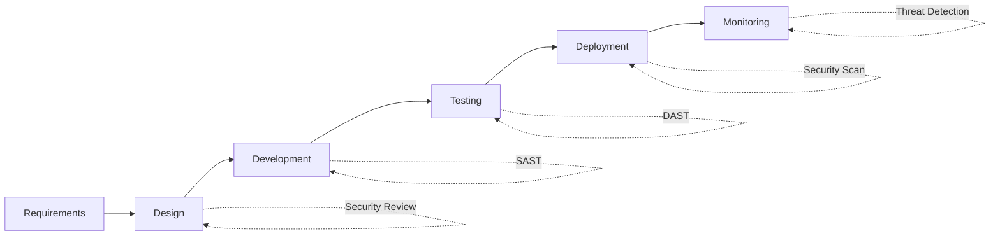

# Security Policy

## Supported Versions

We release security updates for the following versions:

| Version | Supported          |
| ------- | ------------------ |
| 1.x.x   | :white_check_mark: |
| < 1.0   | :x:                |

## Reporting a Vulnerability

We take security seriously in the Shop Floor Resource Allocation System. If you discover a security vulnerability, please follow these steps:

### 🔒 Private Disclosure

**DO NOT** create a public GitHub issue for security vulnerabilities.

Instead, please report security issues privately:

1. **Email:** security@yourcompany.com
2. **Subject:** [SECURITY] Brief description
3. **Include:**
   - Description of the vulnerability
   - Steps to reproduce
   - Potential impact
   - Suggested fix (if any)
   - Your contact information

### Response Timeline

- **Acknowledgment:** Within 48 hours
- **Initial Assessment:** Within 5 business days
- **Status Update:** Every 7 days until resolved
- **Resolution:** Varies by severity (see below)

### Severity Levels

| Severity | Response Time | Examples |
|----------|--------------|----------|
| **Critical** | 24-48 hours | Remote code execution, data breach |
| **High** | 3-7 days | Authentication bypass, XSS |
| **Medium** | 14-30 days | CSRF, information disclosure |
| **Low** | 30-90 days | Minor information leakage |

## Security Best Practices

### For Developers

#### 1. Authentication & Authorization

```typescript
// ✅ Good: Validate tokens
const validateToken = (token: string): boolean => {
  // Implement JWT validation
  return jwt.verify(token, SECRET_KEY);
};

// ❌ Bad: Trust client-side data
const isAdmin = localStorage.getItem('isAdmin');
```

#### 2. Input Validation

```typescript
// ✅ Good: Sanitize and validate inputs
const sanitizeInput = (input: string): string => {
  return input
    .trim()
    .replace(/[<>]/g, '')
    .substring(0, MAX_LENGTH);
};

// ❌ Bad: Use raw input
dangerouslySetInnerHTML={{ __html: userInput }}
```

#### 3. API Security

```typescript
// ✅ Good: Use environment variables
const API_URL = import.meta.env.VITE_API_URL;

// ❌ Bad: Hard-code credentials
const API_KEY = 'secret-key-12345';
```

#### 4. Dependency Management

```bash
# Regular security audits
npm audit

# Fix vulnerabilities
npm audit fix

# Check for outdated packages
npm outdated
```

### For Deployers

#### 1. Environment Variables

**Never commit sensitive data:**

```bash
# ❌ Bad: In .env
VITE_API_KEY=sk-1234567890

# ✅ Good: Use secrets management
# Set in deployment platform or use AWS Secrets Manager
```

#### 2. HTTPS Only

```nginx
# Force HTTPS redirect
server {
    listen 80;
    return 301 https://$host$request_uri;
}
```

#### 3. Security Headers

```nginx
add_header X-Frame-Options "DENY" always;
add_header X-Content-Type-Options "nosniff" always;
add_header X-XSS-Protection "1; mode=block" always;
add_header Referrer-Policy "strict-origin-when-cross-origin" always;
add_header Content-Security-Policy "default-src 'self'; script-src 'self' 'unsafe-inline'; style-src 'self' 'unsafe-inline';" always;
add_header Permissions-Policy "geolocation=(), microphone=(), camera=()" always;
```

#### 4. Rate Limiting

Implement rate limiting on API endpoints:

```typescript
// Example using express-rate-limit
import rateLimit from 'express-rate-limit';

const limiter = rateLimit({
  windowMs: 15 * 60 * 1000, // 15 minutes
  max: 100, // limit each IP to 100 requests per windowMs
  message: 'Too many requests, please try again later.'
});

app.use('/api/', limiter);
```

## Security Checklist

### Pre-Deployment

- [ ] All dependencies updated and audited
- [ ] No hardcoded secrets in code
- [ ] Environment variables properly configured
- [ ] HTTPS enabled
- [ ] Security headers configured
- [ ] Input validation implemented
- [ ] Authentication/authorization working
- [ ] CSRF protection enabled
- [ ] XSS protection implemented
- [ ] SQL injection prevention (if applicable)
- [ ] Rate limiting configured
- [ ] Error messages don't leak sensitive info
- [ ] Logging configured (without sensitive data)

### Post-Deployment

- [ ] SSL certificate valid
- [ ] Security headers verified
- [ ] API endpoints rate-limited
- [ ] Monitoring and alerting enabled
- [ ] Backup strategy implemented
- [ ] Incident response plan ready

## Common Vulnerabilities

### 1. Cross-Site Scripting (XSS)

**Risk:** Attacker injects malicious scripts

**Prevention:**
```typescript
// ✅ Use React's built-in escaping
<div>{userInput}</div>

// ❌ Avoid dangerouslySetInnerHTML
<div dangerouslySetInnerHTML={{ __html: userInput }} />

// If you must use HTML, sanitize it:
import DOMPurify from 'dompurify';
<div dangerouslySetInnerHTML={{ __html: DOMPurify.sanitize(userInput) }} />
```

### 2. Cross-Site Request Forgery (CSRF)

**Risk:** Unauthorized commands from trusted user

**Prevention:**
```typescript
// Use CSRF tokens
headers: {
  'X-CSRF-Token': csrfToken
}

// SameSite cookies
Set-Cookie: session=abc; SameSite=Strict; Secure; HttpOnly
```

### 3. SQL Injection

**Risk:** Malicious SQL queries (if backend uses SQL)

**Prevention:**
```typescript
// ✅ Use parameterized queries
db.query('SELECT * FROM users WHERE id = ?', [userId]);

// ❌ Never concatenate user input
db.query(`SELECT * FROM users WHERE id = ${userId}`);
```

### 4. Insecure Direct Object References (IDOR)

**Risk:** Users access unauthorized resources

**Prevention:**
```typescript
// ✅ Verify ownership
const allocation = await getAllocation(id);
if (allocation.userId !== currentUser.id) {
  throw new ForbiddenError();
}

// ❌ Trust client-provided IDs
const allocation = await getAllocation(req.params.id);
```

### 5. Sensitive Data Exposure

**Risk:** Exposing sensitive information

**Prevention:**
```typescript
// ✅ Don't log sensitive data
logger.info('User logged in', { userId: user.id });

// ❌ Avoid logging passwords, tokens, etc.
logger.info('Login attempt', { password: req.body.password });

// ✅ Redact sensitive fields
const sanitizedUser = { ...user };
delete sanitizedUser.password;
```

## Dependency Security

### Regular Audits

```bash
# Weekly dependency audit
npm audit

# Check for known vulnerabilities
npm audit --audit-level=moderate

# Update dependencies
npm update

# Check for outdated packages
npm outdated
```

### Automated Scanning

**GitHub Dependabot:**
```yaml
# .github/dependabot.yml
version: 2
updates:
  - package-ecosystem: "npm"
    directory: "/"
    schedule:
      interval: "weekly"
    open-pull-requests-limit: 10
```

**Snyk Integration:**
```bash
# Install Snyk CLI
npm install -g snyk

# Authenticate
snyk auth

# Test for vulnerabilities
snyk test

# Monitor project
snyk monitor
```

## Incident Response

### If a Security Breach Occurs:

1. **Contain**
   - Take affected systems offline
   - Revoke compromised credentials
   - Block malicious IPs

2. **Assess**
   - Determine scope of breach
   - Identify affected data
   - Document timeline

3. **Notify**
   - Inform security team
   - Notify affected users (if required)
   - Report to authorities (if required by law)

4. **Remediate**
   - Fix vulnerability
   - Deploy patch
   - Restore services

5. **Review**
   - Conduct post-mortem
   - Update security policies
   - Implement additional safeguards

### Contact

For security incidents:
- **Emergency:** security@yourcompany.com
- **Phone:** +1-XXX-XXX-XXXX (24/7 hotline)

## Security Tools

### Recommended Tools

1. **npm audit** - Built-in dependency scanner
2. **Snyk** - Vulnerability detection
3. **OWASP ZAP** - Web application security scanner
4. **SonarQube** - Code quality and security
5. **Lighthouse** - Security best practices audit

### VS Code Extensions

- **ESLint** - Code quality and security rules
- **SonarLint** - Security vulnerability detection
- **GitGuardian** - Secret detection

## Secure Development Lifecycle



## Compliance

This project aims to comply with:

- **OWASP Top 10** - Web application security risks
- **CWE Top 25** - Most dangerous software weaknesses
- **GDPR** - Data protection (if applicable)
- **SOC 2** - Security, availability, and confidentiality

## Updates to This Policy

This security policy is reviewed quarterly and updated as needed.

**Last Updated:** 2024  
**Next Review:** Q2 2024

---

## Acknowledgments

We appreciate security researchers who responsibly disclose vulnerabilities. Contributors may be acknowledged in our Hall of Fame (with permission).

---

For questions about this policy, contact: security@yourcompany.com
